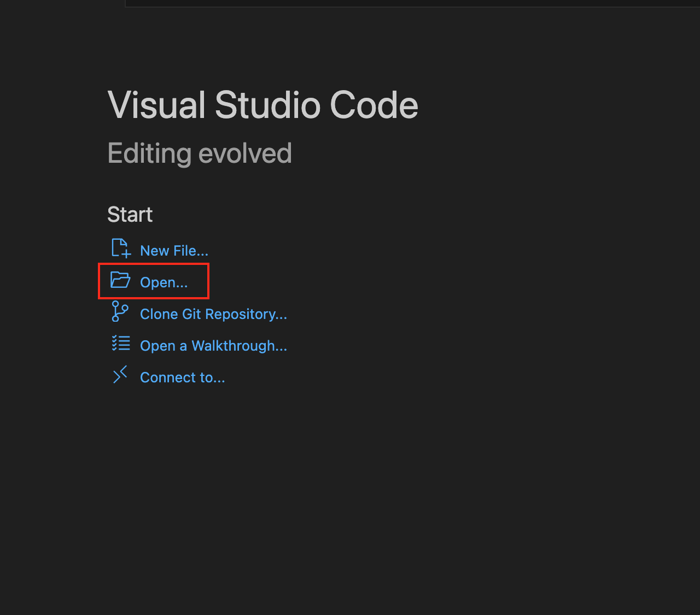
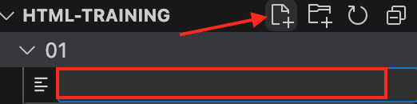

# Task 01: The Building Blocks of Our Website

Before we create an awesome website, we need to learn about **HTML** (HyperText Markup Language). It’s like the skeleton of our website and tells the computer what to show.

HTML is written in special file called an HTML file. You _can_ give it any cool name you want, but the first file is almost always called "index". So our first HTML file would be called "index.html".

## What Are HTML Tags?

HTML is made up of **tags**, which are like special words wrapped in angle brackets `< >`. Tags usually come in pairs: a **begin tag** and an **end tag**. 

### Example:
A simple tag looks like this:
- **Start tag**: `<body>`
- **End tag**: `</body>`

*Notice how the end tag has a forward slash (`/`) before the tag name.*

Everything inside the `<body></body>` tags is what you’ll see on your website.

### Tags Inside Tags
Tags can contain text, images, or even other tags! For example, you might have:
```
<body>
    <p>Hello, world!</p>
</body>
```

### Tags Without an End

Some tags don’t need an end tag, like the image tag ``. It looks like this:

``

#### What Are Attributes?
Tags can also have attributes that give extra information. For example, in the image tag above:

- `src` tells the browser which image to show.
- `width` and `height` decide the size.
- `alt` shows text if the image can’t load.

### Create Your First HTML File
Alright, let’s get this show on the road and create our first HTML file! HTML files are special documents where all the magic happens—they tell your browser what to show on the screen. You could name them anything wild like `awesome-website.html`, but the first page of a website is almost always called `index.html`. Think of it as the homepage’s secret code name. So, let's create `index.html` and start building your very own website!

Start by creating a folder on your computer where you want to store your new website.

Then start **VS Code** and in **VS Code**, select the folder you just created.



To create the new HTML file in your folder, click the "new file" icon and name it `index.html`




### The Starter Template
To start, we need a basic template. This tells the browser, “Hey, this is a webpage!”

```
<!DOCTYPE html>
<html lang="en">
<head>
    <meta charset="UTF-8">
    <meta name="viewport" content="width=device-width, initial-scale=1.0">
    <title>Your Website Title</title>
</head>
<body>
    
</body>
</html>
```

#### What’s in This Code?
- `<!DOCTYPE html>`: Tells the browser we’re using modern HTML.
- `<html>`: Wraps the entire website.
- `<head>`: Holds extra info (like the website’s name).
- `<title>`: This is where you name your website. Make it fun!
- `<meta>`: Gives information like text type (UTF-8) and how to display the site.

Feel free to copy and paste this template or, even better, type it out yourself. Writing it helps you remember!