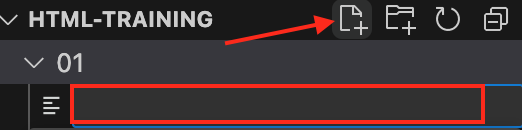

# Task 07: Let's Add Some Style to Our Website

So far, we’ve added lots of HTML tags and content to our website, but let’s be real—it’s not exactly looking amazing yet. It needs color, cool fonts, and a better layout. Luckily, we can make it all happen with **CSS!**

## What Is CSS
CSS stands for Cascading Style Sheets. It’s a set of rules that tells the browser how our HTML should look: what colors to use, which fonts to display, how big things should be, and much more! We won’t go too deep into CSS right now, but here’s the big idea: "Cascading" means that the browser reads the CSS rules in order and decides what’s most important.

Think of HTML as your blank canvas, and CSS as the colorful paints and brushes that let you create a masterpiece!

## CSS for Tags, Classes, and IDs
There are different ways to tell CSS what to style. The three most common are:

- **Tags:** Rules that apply to all elements of a specific type, like all <div> tags.
- **Classes:** Rules that apply to all elements with the same class name. You can use a class on multiple elements.
- **IDs:** Rules that apply to just one specific element with a unique ID. You only use an ID once per page.

## CSS Example
In CSS, we call the tag, class, or id we want to style a "selector" (because it selects what we’re styling). CSS rules go inside curly brackets {} and include properties and values.

Let’s say we want to style all <div> tags. Here’s an example:

```
div {
    background-color: rgb(0, 0, 0);
    color: rgb(255, 255, 255);
    padding: 10px;
}
```

If you want to style a specific `class`, like one that makes text red, it looks like this:

```
.text-red {
    color: rgb(255, 0, 0); /* red */
}
```

_(Notice the . before text-red! That’s how you define a class in CSS. You can name the class anything you like, but keep it descriptive.)_

To style a specific `id`, it would look like this:

```
#onlyThisElementHasRedText {
    color: rgb(255, 0, 0); /* red */
}
```

_(Notice the # before onlyThisElementHasRedText! That’s how we define an ID in CSS.)_


## A Quick Note on Casetypes

You’ll see different naming styles, called "cases," in programming. Here are a few you’ll likely come across:

- **PascalCase**: Each word starts with a capital letter.
- **camelCase**: The first word starts lowercase, with each new word capitalized.
- **snake_case**: Words are joined with underscores  (`_`)
- **kebab-case** Words are joined with dashes (`-`)

In web development, **camelCase** and **kebab-case** are the most common!


## Link the CSS in HTML
First, let’s create a new file just like we did for `index.html`. Call it `index.css`.



After that, we need to "link" the CSS file in our HTML so the browser knows to use it. Add this `<link />` tag in the `<head>` section of your HTML file, right before `</head>`:

`<link rel="stylesheet" href="index.css" type="text/css" />`

_(Note that `<link />` is also self-closing, just like ``.)_

- **rel:** This describes the relationship between our HTML and CSS files
- **href:** This is the file path (or location) of the CSS file.
- **type:** This specifies that the file contains CSS text.

## Solution

If you’re stuck, don’t worry! You can check out the full solution in the **07** folder for a sneak peek.
